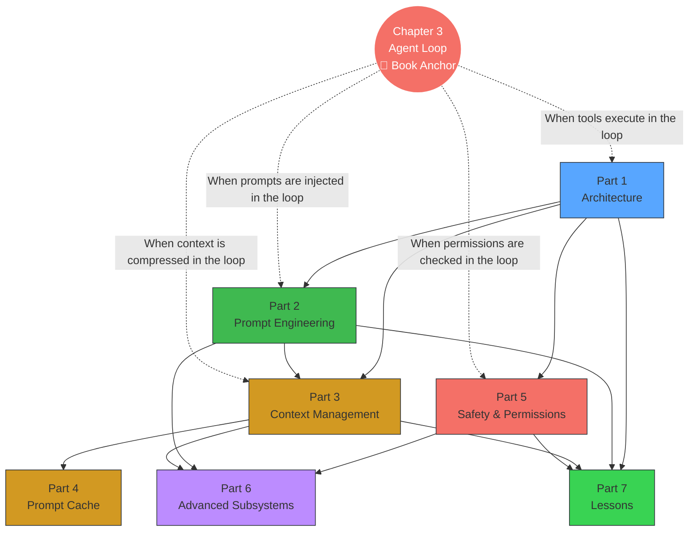

# <a href="#preface" class="header">서문</a>

[중국어판 읽기](../)

*하네스 엔지니어링* — 중국어로 비공식적으로 "The Horse Book"으로 알려져 있음
(중국어 제목이 말 마구처럼 "마구"처럼 들리기 때문입니다).

나는 Claude Code 소스 코드를 "소비"하는 가장 좋은 방법은 다음과 같다고 생각합니다.
체계적인 학습을 위한 책으로 바꿔보세요. 나에게 있어서 배우는 것은
책은 원시 소스 코드를 읽는 것보다 더 편안합니다.
완전한 인지 프레임워크를 형성하는 것이 더 쉽습니다.

그래서 Claude Code에게 유출된 TypeScript 소스에서 책을 추출하도록 했습니다.
암호. 이제 이 책은 오픈소스로 공개되어 누구나 온라인에서 읽을 수 있습니다.

- 저장소:
<https://github.com/ZhangHanDong/harness-engineering-from-cc-to-ai-coding>
- 온라인 읽기:
<https://zhanghandong.github.io/harness-engineering-from-cc-to-ai-coding/>

좀 더 직관적으로 책을 읽고 싶다면
Claude Code의 내부 메커니즘을 이해하고 이를 이와 결합하여
시각화 사이트를 적극 권장합니다:

- 시각화 사이트: <https://ccunpacked.dev>

최고의 AI 글쓰기 품질을 보장하기 위해 추출 프로세스
"모델에 소스 코드를 던지고 그대로 두는 것"만큼 간단하지 않았습니다.
생성합니다." 대신 상당히 엄격한 엔지니어링 작업 흐름을 따랐습니다.

1. 먼저 소스 코드를 기반으로 `DESIGN.md`에 대해 논의하고 명확히 합니다.
즉, 책 전체의 개요와 디자인을 확립합니다.
2. 그런 다음 내 오픈 소스 `agent-spec`를 사용하여 각 장의 사양을 작성합니다.
장 목표, 경계 및 수용을 제한하기 위해
기준.
3. 다음으로 구체적인 실행 단계를 세분화하여 계획을 작성합니다.
4. 마지막으로, 기술적인 글쓰기 능력을 쌓기 전에
AI가 공식적인 글쓰기를 시작합니다.

이 책은 출판을 목적으로 한 것이 아닙니다. 학습에 도움을 주기 위한 것입니다.
클로드 코드를 더욱 체계적으로. 내 기본 판단은 다음과 같습니다. AI는 물론입니다.
완벽한 책을 쓸 수는 없지만 초기 버전이 있는 한
오픈 소스이므로 누구나 읽고, 토론하고, 점진적으로 개선할 수 있습니다.
함께, 진정으로 가치 있는 공개 도메인 도서로 공동 구축합니다.

즉, 객관적으로 말하면 이 초기 버전은 이미 상당히
잘 쓰여졌습니다. 기여와 토론을 환영합니다. 보다는
별도의 토론 그룹을 생성하면 관련된 모든 대화가
GitHub 토론에서 호스팅됨:

- 토론:
<https://github.com/ZhangHanDong/harness-engineering-from-cc-to-ai-coding/discussions>

-----------------------------------------------------------

## <a href="#reading-preparation" class="header">읽기 준비</a>

### <a href="#prerequisites" class="header">전제조건</a>

이 책에서는 독자가 다음과 같은 기본 사항을 갖추고 있다고 가정합니다.
다음 사항을 읽고 이해할 수 있는 전문가가 되십시오.

- **TypeScript / JavaScript**: 책의 모든 소스 코드는
타입스크립트. `async/await`, 인터페이스를 이해해야 합니다.
정의, 제네릭 및 기타 기본 구문이 있지만 그럴 필요는 없습니다.
그것을 쓰세요.
- **CLI 개발 개념**: 프로세스, 환경 변수,
stdin/stdout, 하위 프로세스 통신. 터미널 도구를 사용한 경우
(git, npm, 화물) 이러한 개념은 이미 익숙합니다.
- **LLM API 기본**: 메시지 API 이해
(시스템/사용자/보조 역할), tool_use (함수 호출), 스트리밍
(스트리밍된 응답). LLM API를 호출했다면 그것으로 충분합니다.

필수 사항: React/Ink 경험, Bun 런타임 지식, Claude Code
사용 경험.

### <a href="#recommended-reading-paths" class="header">추천 도서
경로</a>

이 책은 30개의 장이 7개의 부분으로 구성되어 있지만, 꼭 그럴 필요는 없습니다.
처음부터 끝까지 읽어보세요. 다음은 독자를 위한 세 가지 경로입니다.
다른 목표:

**경로 A: Agent Builders**(자신만의 AI 에이전트를 구축하려는 경우)

> 1장(테크 스택) → 3장(에이전트 루프) → 5장(시스템)
> 프롬프트) → 9장(자동 압축) → 20장(에이전트 생성) →
> 25~27장(패턴 추출) → 30장(실습)

이 경로는 컨텍스트 관리에 대한 프롬프트로 루프하는 아키텍처를 다룹니다.
다중 에이전트로 전환하여 완전한 에이전트를 구축하는 30장에서 정점에 이릅니다.
Rust의 코드 검토 에이전트.

**경로 B: 보안 엔지니어**(AI 에이전트 보안에 관심이 있는 경우)
경계)

> 16장(허가제도) → 17장(YOLO 분류자) →
> 18장(Hooks) → 19장(CLAUDE.md) → 4장(Tool)
> 오케스트레이션) → 25장 (Fail-Closed 원칙)

이 경로는 권한 모델부터 심층적인 방어에 중점을 둡니다.
사용자 차단 지점에 대한 자동 분류, 방법 이해
Claude Code는 자율성과 안전의 균형을 유지합니다.

**경로 C: 성능 최적화**(LLM 지원에 관심이 있는 경우)
비용 및 대기 시간)

> 9장(자동다짐) → 11장(미세다짐) → 11장
> 12장(토큰 예산) → 13장(캐시 아키텍처) → 14장
> (캐시 파손 감지) → 15장 (캐시 최적화) → 21장
> (노력/생각)

이 경로는 추론에 대한 캐싱을 프롬프트하는 컨텍스트 관리를 다룹니다.
Claude Code가 어떻게 API 비용을 90% 절감하는지 이해합니다.

> **장 번호 매기기 정보**: 일부 장에는 문자 접미사가 있습니다(예:
> ch06b, ch20b, ch20c, ch22b) — 이는 메인의 심층적인 확장입니다.
> 장. 예를 들어 ch20b(Teams) 및 ch20c(Ultraplan)는 깊이가 있습니다.
> ch20(에이전트 생성)으로 들어갑니다.

### <a href="#book-knowledge-map" class="header">도서 지식 지도</a>

3장(에이전트 루프)은 책의 핵심입니다.
사용자 입력에서 모델 응답까지 순환합니다. 다른 부분은 각각 분석합니다.
해당 주기 내 특정 단계의 심층 메커니즘.

### <a href="#reading-notation" class="header">기보법 읽기</a>

이 책에서는 다음 규칙을 사용합니다.

- **소스 참조**: 형식은 `restored-src/src/path/file.ts:line`입니다.
Claude Code v2.1.88의 복원된 소스를 가리킵니다.
- **증거 수준**:
- "v2.1.88 소스 증거" — 완전한 소스 코드와 줄 번호가 있습니다.
참고자료, 최고의 신뢰도
- "v2.1.91/v2.1.92 번들 리버스 엔지니어링" — 번들에서 추론됨
문자열 신호; v2.1.89부터 인류가 제거한 소스 맵
- "추론" — 이벤트 이름이나 변수 이름만으로 추측,
직접적인 출처 증거 없음
- **인어 다이어그램**: 순서도 및 아키텍처 다이어그램에서는 인어를 사용합니다.
온라인에서 읽을 때 자동으로 렌더링되는 구문입니다.
- **대화형 시각화**: 일부 장에서는 D3.js를 제공합니다.
대화형 애니메이션 링크("보려면 클릭"으로 표시됨)
브라우저에서 열 수 있습니다. 각 애니메이션에는 정적 인어도 있습니다.
대체 수단으로 다이어그램을 사용합니다.
